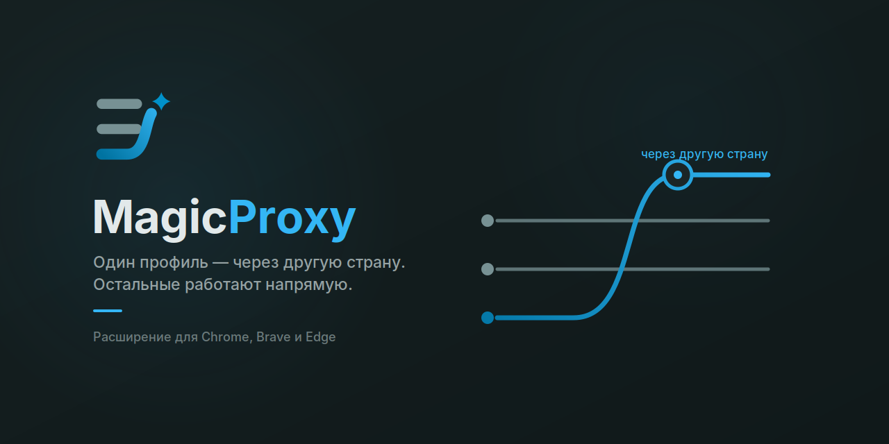

<div align="center">



**Прокси не для всего компьютера, а для одного профиля браузера.**

[](LICENSE)
[](https://github.com/MagicMaxLabs/MagicProxy/releases/latest)
[](https://github.com/MagicMaxLabs/MagicProxy/releases)
[](https://github.com/MagicMaxLabs/MagicProxy/actions)

</div>

---

Иногда нужно зайти в один и тот же сервис под разными аккаунтами, и чтобы каждый
выглядел из своей страны: со своими куками, своим хранилищем, своим выходом в сеть.
Правилами маршрутизации это не решается. Правила смотрят, **куда** идёт запрос, а
адрес у обоих аккаунтов один и тот же. Различаться должен браузер, а не назначение.

Особенно заметно на оплате. Одна и та же зарубежная карта через один сервер проходит,
через другой платёж отклоняют. И перенастраивать клиент перед каждой попыткой — плохая
идея: вместе с сервером меняется окружение, а оно как раз должно оставаться прежним.

MagicProxy закрывает ровно эту дыру. Включаешь его в нужном профиле Chromium, и через
твой сервер ходит только этот профиль. Соседние профили, почта, игры, всё остальное на
компьютере — как было.

Внутри полноценный VLESS-клиент с Reality и XTLS-Vision. Наружу торчит одна кнопка.

## Зачем это нужно

Несколько аккаунтов одного сервиса, каждый со своей страной и своим окружением.
Оплата зарубежной картой, когда важно, из какой сети приходит платёж. Рабочее и личное
с разными выходами. И просто удобно пользоваться своим сервером, не открывая отдельную
программу.

**Чем отличается от v2rayN, Hiddify и подобных.** Маршрутизацию они умеют, но делят
трафик по адресу назначения: этот домен через прокси, тот напрямую. MagicProxy делит
по профилю браузера, поэтому два профиля могут ходить **на один и тот же сайт через
разные серверы**. Правилами так не сделать. С уже установленным клиентом уживается —
у меня они работают одновременно.

## Установка

1. Скачай **[MagicProxy-Setup.exe](https://github.com/MagicMaxLabs/MagicProxy/releases/latest)**
   и запусти. Внутри уже всё, что нужно: сетевое ядро вложено, интернет для установки
   не требуется, права администратора тоже.
2. Добавь расширение в браузер. *(В Chrome Web Store оно на модерации, пока ставится
   через «Загрузить распакованное» — как, написано ниже.)*
3. Открой 🪄 на панели, вставь ссылку на свой сервер, нажми **Включить**.

<details>
<summary>Пока расширения нет в магазине — как поставить</summary>

Скачай `MagicProxy-windows-amd64.zip` из релиза и распакуй. Открой `brave://extensions`
(или `chrome://extensions`), включи **Режим разработчика**, нажми **Загрузить
распакованное** и укажи папку `extension`.

</details>

> **Windows покажет синее окно «Windows защитила ваш компьютер».** Так он встречает
> любую программу без платной цифровой подписи, у меня её нет. Нажми **«Подробнее» →
> «Выполнить в любом случае»**. Если хочешь сверить файл перед запуском, его хеш лежит
> в `SHA256SUMS.txt` рядом с релизом.

## Поддерживаемые протоколы

VLESS (REALITY, XTLS-Vision, ws, grpc, httpupgrade), VMess, Trojan, Shadowsocks
(+ShadowTLS), Hysteria2, Hysteria, TUIC, AnyTLS, WireGuard, SSH. Плюс обычные
апстрим-прокси: SOCKS5, SOCKS4, HTTP, HTTPS, с авторизацией и без.

Ссылки импортируются как есть: `vless://`, `vmess://`, `trojan://`, `ss://`,
`hysteria2://`, `hysteria://`, `tuic://`, `anytls://`, `ssh://`, `socks5://`,
`http(s)://`, а также base64-подписки. Для WireGuard и ShadowTLS в редакторе профиля
есть шаблоны, потому что ссылками они не описываются.

## Почему две части, а не одно расширение

Этот вопрос задают чаще всего, поэтому отвечу сразу.

Расширение Chromium физически не может само гнать трафик по VLESS. `chrome.proxy`
понимает только HTTP и SOCKS, а песочница MV3 не открывает сырые сокеты и не слушает
порт. Поэтому с сервером говорит небольшой фоновый компонент (запускает его сам
браузер), а расширение направляет в него трафик своего профиля.

Единственная чисто браузерная альтернатива, Direct Sockets в Isolated Web Apps,
обычным пользователям вне ChromeOS недоступна, а Brave её намеренно отключает. Так
что выбора здесь на самом деле нет. Как всё устроено внутри:
[docs/HOW-IT-WORKS.md](docs/HOW-IT-WORKS.md).

## Приватность

Аккаунтов нет, телеметрии нет, аналитики нет. Данные твоих серверов лежат локально в
профиле браузера и никуда не уходят: у проекта попросту нет серверов, куда их можно
было бы отправить. Доступ к сайтам расширение не запрашивает и в страницы ничего не
внедряет.

Отдельно стоит прочитать, чего MagicProxy **не** делает: это не анонимность, WebRTC
может выдать реальный адрес, креды серверов хранятся в открытом виде. Всё это разобрано
в [SECURITY.md](SECURITY.md), там же сказано, что с этим делать. Формальная политика
приватности — [PRIVACY.md](PRIVACY.md).

## Проверка загрузки

```powershell
Get-FileHash .\MagicProxy-Setup.exe -Algorithm SHA256
```

Сверь с `SHA256SUMS.txt` в релизе. Сборки собираются в открытом CI из помеченного
коммита, и у каждой есть криптографическое подтверждение происхождения:

```
gh attestation verify MagicProxy-Setup.exe --repo MagicMaxLabs/MagicProxy
```

## Совместимость с другими клиентами

**В обычном режиме прокси конфликта нет.** Ядро слушает свой локальный порт, не
дефолтные 10808 и 10809, а `chrome.proxy` переопределяет системные настройки только
для своего профиля. Проверял с Clash Verge: MagicProxy выключен — трафик идёт через
Clash, включён — через MagicProxy.

> ### ⚠️ Режим TUN в другом клиенте несовместим
>
> Если Clash Verge, Hiddify, v2rayN или sing-box работают в режиме **TUN**, они
> поднимают виртуальный адаптер и забирают весь трафик системы. В том числе исходящее
> соединение MagicProxy к твоему серверу. Получается двойное проксирование, и
> протоколы, которые проверяют подлинность сервера, ломаются. Для VLESS+REALITY это
> выглядит так:
>
> ```
> connection: open connection to ... using outbound/vless[proxy]: reality verification failed
> ```
>
> **Что делать:** переключить второй клиент в обычный режим прокси либо добавить адрес
> твоего сервера в его список исключений.
>
> Эту ситуацию MagicProxy узнаёт сам. Если ядро падает с такой ошибкой, а в системе
> есть активный TUN-адаптер, в логах появится объяснение по-русски, а не только
> сообщение ядра.

## Сборка из исходников

См. [CONTRIBUTING.md](CONTRIBUTING.md).

## Благодарности

Сетевое ядро — **[sing-box](https://github.com/SagerNet/sing-box)** от SagerNet
(GPL-3.0-or-later, © 2022 nekohasekai). Всю настоящую работу с протоколами делает оно,
и это стоит проговорить прямо. Ядро вложено в установщик без изменений; текст лицензии
и ссылка на исходники ровно той версии — в [third-party/sing-box/](third-party/sing-box/).
MagicProxy не является производной работой sing-box и не аффилирован с проектом.

## Как это разрабатывалось

Проект сделан в связке с ИИ. Архитектурные решения, ревью и приёмка мои.

Перед публикацией код прошёл аудит: шесть независимых проверок по разным направлениям,
и каждая находка потом отдавалась отдельному проверяющему с задачей её опровергнуть.
Что подтвердилось — исправлено, что осталось — лежит в
[issues](https://github.com/MagicMaxLabs/MagicProxy/issues) открытым текстом.

На слово верить не нужно. Сборка идёт в открытом CI из помеченного коммита, у каждого
релиза есть `SHA256SUMS.txt` и подпись происхождения, а собрать самому и сравнить
результат можно по [CONTRIBUTING.md](CONTRIBUTING.md).

## Лицензия

Код MagicProxy — [MIT](LICENSE). Вложенный sing-box под своей лицензией, см. выше.
